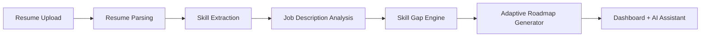

# 🚀 SkillPath AI  
### Turning Resumes into Intelligent Learning Journeys

---

---

## 🧠 Overview

In today’s competitive job market, candidates struggle to identify the gap between their current skills and job requirements.

**SkillPath AI** solves this by:
- Analyzing resumes and job descriptions
- Detecting skill gaps using AI
- Generating personalized learning roadmaps

> 🚀 From confusion → clarity → job readiness

---

## ✨ Features

### 🔍 Intelligent Resume Analysis
- NLP-based resume parsing
- Extracts skills, experience, education

### 🎯 Skill Gap Detection
- Semantic matching (NOT keyword-based)
- Identifies missing & weak skills

### 🧠 Adaptive Learning Engine
- Graph-based roadmap generation
- Dependency-aware skill sequencing
- Personalized timelines (e.g., 3 weeks)

### 📊 Smart Dashboard
- Skill match score (e.g., 87%)
- Missing skills tracking
- Role readiness percentage
- Progress analytics

### 🤖 AI Assistant
- Real-time guidance
- Career suggestions

---

## 🏗️ System Architecture

---

## ⚙️ Tech Stack
### 🖥️ Frontend
- React.js
- Tailwind CSS
### ⚡ Backend
- Node.js
- Express.js
### 🤖 AI & NLP
- LLM (OpenAI / Llama)
- Embedding Models
- NLP Pipelines
### 🗄️ Database
- MongoDB / PostgreSQL
- Vector Database (for embeddings)

---

## 🧩 Core Algorithms

### 1️⃣ Skill Extraction
- NLP-based entity recognition  
- Converts unstructured resume → structured skills  

### 2️⃣ Skill Gap Engine
- Embedding-based similarity (cosine similarity)  
- Resume vs Job Description comparison  

### 3️⃣ Adaptive Pathing Algorithm
- Graph-based learning roadmap  
- Nodes = skills  
- Edges = dependencies  
- Dynamic sequencing based on user level  

### 4️⃣ Personalization Engine
- Adjusts roadmap duration  
- Recommends courses dynamically

---

## 📊 Datasets Used

- 📁 Resume Dataset (Kaggle)  
- 📊 O*NET Database  
- 💼 Jobs & Job Descriptions Dataset (Kaggle)  

---

## 📈 Performance Metrics

| Metric                     | Value                     |
|--------------------------|---------------------------|
| Skill Match Accuracy     | **87%**                  |
| Recommendation Precision | **98%**                  |
| Time Saved               | **~3x faster onboarding** |

---

## 🚀 How It Works

1. Upload Resume  
2. Add Job Description  
3. AI analyzes skills  
4. Detects gaps  
5. Generates roadmap  

---

## 🧪 Future Improvements

- 🎓 Integration with real course platforms (Coursera, Udemy)  
- 📱 Mobile app version  
- 🧠 Advanced knowledge tracing models  
- 🤝 Recruiter-side dashboard  

---

## 🤝 Contributing

Contributions are welcome!  
Feel free to fork and improve the project.  

---

## 📄 License

This project is for educational and hackathon purposes.  

---

## 👨‍💻 Team

**CodeX**  
Members: Raunak, Ansh, Devisingh, Jay  

---

## 🌟 Final Note

SkillPath AI is not just a tool — it's a career intelligence engine.
